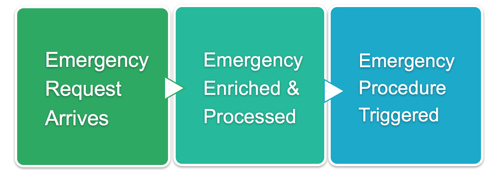
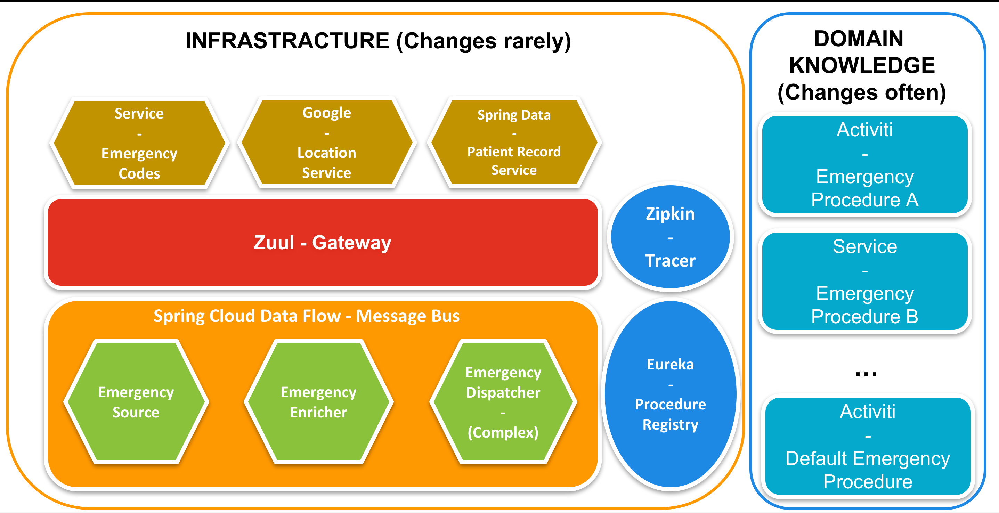

# jbcnconf 2017: Emergency Dispatcher Demo
Emergency Dispatcher Demo for JBCN Conf 2017

## Goals and Motivations
This repository contains a simple example using the following frameworks:
- Spring Cloud Data Flow
- Spring Cloud Bus
- Spring Boot
- Eureka (and Feign)
- Activiti Process Engine

This example is intended to show how we can improve communication and collaboration with Domain Experts that can express their Domain Knowledge using different types of Models. These microservices show how we can mix and match the tools that we have available, to make sure that we use the best tool for the job at hand.



## Services

* Patient Record Service: just a Patient Repository
* Emergency Source: Endpoint in charge of receiving Emergency Notifications, it will dispatch the notification using the message bus, so it can be processed asap.
* Emergency Enricher: Processor in charge of decorating the initial emergency report with more information. This Processor uses other services such as the Patient Record Service to decorate the emergency information with extra data if the Patient is known by the organization. This service process the emergency and send via a message the decorated Emergency.
* Emergency Dispatcher: This service is in charge of deciding how to deal with a specific Emergency. This service will have the domain expertise to know which of the available procedures should be used to deal with an Emergency based on the Emergency available information.
* Emergency Procedure <X>: these services represent different types of procedures for different types of emergencies.
* Procedure Registry: this service encapsulate an instance of Eureka that is used to register each of our procedures and their metadata
* Gateway: this service will automatically discover other services and expose them via http in the port 8080



## Set up and Run

We are using Spring Data Flow to connect Sources, Processors and Sinks together via Streams
We are also using Docker compose in order to start some providers such as RabbitMQ

## Build all Maven modules (@TODO: create script):
Run 'mvn clean install' in all the maven modules
```
cd ./emergency-dispatcher
mvn clean install
cd ../emergency-enricher
mvn clean install
cd ../emergency-procedure-default
mvn clean install
cd ../emergency-procedure-fire
mvn clean install
cd ../emergency-source
mvn clean install
cd ../gateway
mvn clean install
cd ../patient-records-service
mvn clean install
cd ../procedure-registry-service
mvn clean install
cd ..

```


### Start Docker Compose Rabbit MQ And Zipkin Docker Compose
```
cd docker/
docker-compose up -d

cd ..
cd zipkin/
docker-compose up -d
```

### Download Spring Data Flow
```
curl -O https://repo.spring.io/libs-snapshot/org/springframework/cloud/spring-cloud-dataflow-server-local/1.2.2.RELEASE/spring-cloud-dataflow-server-local-1.2.2.RELEASE.jar
```

### Start the Server
```
java -jar spring-cloud-dataflow-server-local-1.2.2.RELEASE.jar
```

### Download the Data Flow Shell (in a new terminal tab)
```
curl -O https://repo.spring.io/libs-snapshot/org/springframework/cloud/spring-cloud-dataflow-shell/1.2.2.RELEASE/spring-cloud-dataflow-shell-1.2.2.RELEASE.jar
```

### Start the Data Flow Shell 
```
java -jar spring-cloud-dataflow-shell-1.2.2.RELEASE.jar 
```

### Registering Apps and configuring & deploying the stream definition

#### Commands 
Run these commands in the Data Flow Shell you just started.  Alternatively you can use the [Flo Dashboard](http://localhost:9393/dashboard)

```
app register --name emergency-source --type source --uri maven://com.example:emergency-source:jar:0.0.1-SNAPSHOT

app register --name emergency-enricher --type processor --uri maven://com.example:emergency-enricher:jar:0.0.1-SNAPSHOT

app register --name emergency-dispatcher --type sink --uri maven://com.example:emergency-dispatcher:jar:0.0.1-SNAPSHOT

stream create --name emergency-stream --definition "emergency-source | emergency-enricher | emergency-dispatcher"

stream deploy --name emergency-stream
```
### Starting other required services
The stream will automatically bootstrap and register the Emergency Source, Emergency Enricher and Emergency Dispatcher projects, but you still need to boot up the following independent modules:

#### Gateway:
```
cd gateway/
mvn spring-boot:run
```
#### Procedure Registry Service:
```
cd procedure-registry-service/
mvn spring-boot:run
```
#### Patient Record Service:
```
cd patient-records-service/
mvn spring-boot:run
```
#### Emergency Procedure Default:
```
cd emergency-procedure-default/
mvn spring-boot:run
```
#### Emergency Procedure X: (you can start as many as you want of these procedures)
```
cd emergency-procedure-(xx)/
mvn spring-boot:run
```


### Creating a New Emergency Request
The Emergency Source project expose a REST endpoint where you can send new Emergencies.
These emergencies will be propagated to the Emergency Enricher which will decorate the emergency information by calling the Patient Record Service using RestTemplate. Once the Emergency is decorated it will send a message that will be picked up by the Emergency Dispatcher which will query Eureka to see which Procedures are available and based on the information inside the Emergency it will dispatch the Emergency to one of these procedures instances.


In order to create a new emergency you need to send a POST request to http://localhost:8080/emergency-source/api/emergency/
With the following body:
```
{
    "ssn": "ABC-123",
    "location": {
        "latitude": 1,
        "longitude": 2
    },
    "date": 1496648974639,
    "code": "011"
}
```
Alternatively, you can use the Chrome (extension) POSTman collection found in the root directory.

### Access Points

 * Eureka Service Registry  [http://localhost:9393/dashboard](http://localhost:9393/dashboard)

 * Zuul (Gateway) http://localhost:8080/routes

 * Zipkin (Tracer) http://docker_machine_ip:9411/zipkin/ [Example:http://192.168.99.100:9411/zipkin/](http://192.168.99.100:9411/zipkin/)


